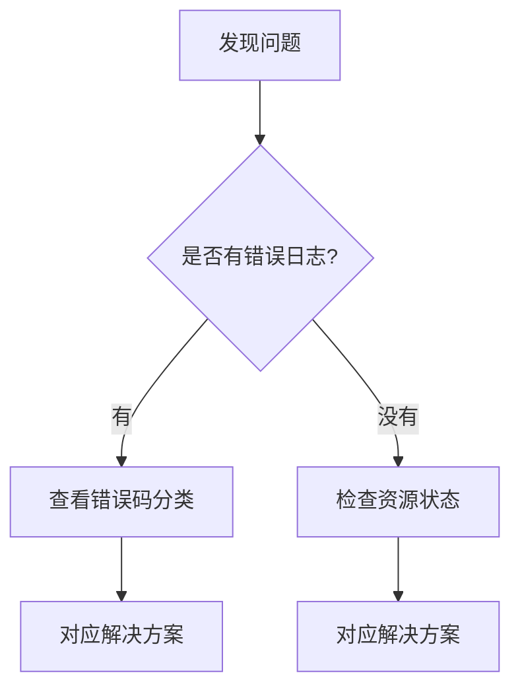

# 📄 文档模板库

> 直接复制使用，填入内容即可。不用从零开始想结构。

---

## 模板一：教程文档（Tutorials）

适用于：**手把手带读者从零完成某件事**

```markdown
# [动词]：[你将构建/完成的具体事情]

> 完成本教程后，你将拥有 [具体成果]。
> 本教程适合 [目标读者]，需要 [预计时间]。

**先决条件**：
- [ ] 已安装 [工具 A](link)（版本 X.X+）
- [ ] 熟悉 [概念 B] 的基础用法
- [ ] 拥有 [账号/权限]

---

## 你将构建的东西

[2-3 句话描述最终成果，如果有截图/演示更好]

## 步骤 1：[动作描述]

[在做这步之前，说明一下这步要做什么，以及为什么需要做]

```bash
# 命令示例
command --flag value
```

你应该看到类似这样的输出：
```
Expected output here
```

> **💡 提示**：如果遇到 `错误信息`，[解决方法]

## 步骤 2：[动作描述]

...

## 步骤 N：验证结果

[告诉读者如何确认一切正常]

```bash
# 验证命令
```

预期结果：
```
Success: ...
```

## 总结

你完成了 [总结成就]。在这个过程中，你学到了：
- **[概念 A]**：[一句话说明你学到的关键点]
- **[概念 B]**：[一句话说明你学到的关键点]

## 下一步

- [进阶教程：如何...](link)
- [参考文档：完整配置说明](link)

---
*最后更新：YYYY-MM-DD*
```

---

## 模板二：操作指南（How-to）

适用于：**帮助有经验的读者完成特定任务**

```markdown
# 如何 [具体要做的事情]

> **适用场景**：[什么情况下需要做这件事]  
> **适用版本**：[版本范围]  
> **最后更新**：YYYY-MM-DD

**你需要**：
- 对 [相关技术] 有基础了解
- [工具/权限] 已就绪

---

## 背景

[1-2 句话说明这个任务的背景，为什么需要这样做]

## 操作步骤

### 1. [第一步]

[简短说明，不用解释太多原理]

```bash
命令
```

### 2. [第二步]

...

## 验证

[如何确认操作成功]

## 常见问题

### 遇到 [错误信息] 怎么办？

**原因**：[为什么会出现这个错误]  
**解决**：[具体怎么解决]

```bash
# 解决命令
```

## 注意事项

> **⚠️ 注意**：[重要的注意事项]

---
*最后更新：YYYY-MM-DD*
```

---

## 模板三：参考文档（Reference）

适用于：**提供结构化、可查阅的技术细节**

```markdown
# [技术名称] 参考手册

> 快速查阅 [技术名称] 的配置项、命令、API 等信息。

**适用版本**：X.X.x  
**最后更新**：YYYY-MM-DD  

---

## 配置项

| 参数名 | 类型 | 默认值 | 说明 | 示例 |
|--------|------|--------|------|------|
| `param.one` | `string` | `"default"` | [说明] | `"value"` |
| `param.two` | `int` | `5000` | [说明，毫秒] | `3000` |
| `param.three` | `boolean` | `true` | [说明] | `false` |

## 常用命令

| 命令 | 说明 | 示例 |
|------|------|------|
| `command start` | 启动服务 | `service start --port 8080` |
| `command stop` | 停止服务 | `service stop` |
| `command status` | 查看状态 | `service status` |

## API 接口

### GET /api/v1/resource

获取资源列表。

**请求参数**：

| 参数 | 类型 | 必填 | 说明 |
|------|------|------|------|
| `page` | `int` | 否 | 页码，默认 1 |
| `size` | `int` | 否 | 每页条数，默认 20，最大 100 |

**响应示例**：

```json
{
  "code": 200,
  "data": {
    "list": [],
    "total": 0,
    "page": 1
  }
}
```

**错误码**：

| 错误码 | 说明 | 处理建议 |
|--------|------|----------|
| `400` | 参数错误 | 检查请求参数格式 |
| `401` | 未授权 | 检查 Token 是否过期 |
| `500` | 服务器内部错误 | 查看服务日志 |

---
*最后更新：YYYY-MM-DD*
```

---

## 模板四：解释文档（Explanation）

适用于：**帮助读者深入理解某个概念或设计决策**

```markdown
# [概念名称]：深入理解

> 本文解释 [概念] 的核心原理，帮助你建立正确的心智模型，
> 理解它的适用场景和局限性。

**阅读前提**：了解 [基础概念]  
**预计阅读**：15 分钟  

---

## 它解决了什么问题？

[用一个具体的场景说明，如果没有这个技术/机制，会遇到什么困境]

**例如**：在分布式系统中，如果多个服务同时操作同一份数据...

## 核心原理

[解释它是如何工作的，可以用图、类比、代码辅助]

### 关键概念 A

...

### 关键概念 B

...

## 为什么这样设计

[解释设计上的权衡取舍，比如为什么选 A 而不是 B]

- **优势**：...
- **代价**：...（没有完美方案，要诚实）

## 适用场景 vs 不适用场景

**适合用在**：
- 场景一：...
- 场景二：...

**不适合用在**：
- 场景一：... （用 X 方案更好）

## 常见误解

### 误解 1：[错误认知]

**实际上**：[正确理解]

## 延伸思考

[留几个问题让读者思考，或者指向更深的内容]

---

## 参考资料

- [论文/文章标题](link) — 一句话说明为什么值得读
- [官方文档](link)

---
*最后更新：YYYY-MM-DD*
```

---

## 模板五：模块 README（入口文档）

适用于：**每个目录下的 README.md**

```markdown
# [模块名称]

> [一句话说明这个模块包含什么，适合什么场景使用]

---

## 📦 内容概览

| 文档 | 类型 | 说明 |
|------|------|------|
| [快速开始](./getting-started.md) | 教程 | 10分钟上手 |
| [如何配置集群](./how-to/cluster.md) | 操作指南 | 集群部署 |
| [配置参数说明](./reference/config.md) | 参考 | 所有配置项 |
| [工作原理](./concepts/internals.md) | 解释 | 深入理解 |

## 🗺 学习路径

**新手**：[快速开始](./getting-started.md) → [基础概念](./concepts/basics.md)

**有经验的开发者**：直接查阅 [操作指南](./how-to/) 或 [参考文档](./reference/)

**想深入理解**：[工作原理](./concepts/internals.md) → [高级配置](./how-to/advanced.md)

## 📋 最近更新

- `2026-04-22` 新增集群部署指南
- `2026-04-01` 更新配置参数说明（适配 v3.x）

---
*如发现错误请提 Issue | 最后更新：YYYY-MM-DD*
```

---

## 模板六：故障排查文档（Troubleshooting）

适用于：**记录常见问题和解决方案**

```markdown
# [组件/功能] 故障排查手册

> 遇到问题不要慌，先查这里。覆盖 90% 的常见故障场景。

**适用版本**：[版本]  
**最后更新**：YYYY-MM-DD  

---

## 快速诊断流程



（或用文字描述排查流程）

## 错误码速查

| 错误信息 | 可能原因 | 快速解决 |
|----------|----------|----------|
| `Connection refused` | 服务未启动 / 端口错误 | [查看详情](#connection-refused) |
| `OutOfMemoryError` | 内存不足 | [查看详情](#oom) |
| `Timeout` | 网络问题 / 服务过载 | [查看详情](#timeout) |

## 详细解决方案

### Connection refused {#connection-refused}

**症状**：...

**排查步骤**：
1. 检查服务是否启动：`systemctl status xxx`
2. 检查端口是否监听：`netstat -tlnp | grep 8080`
3. 检查防火墙：...

**根本原因**：...

**永久解决**：...

---
### OOM（OutOfMemoryError）{#oom}

[同上格式]

---
*最后更新：YYYY-MM-DD*
```

---

*最后更新：2026-04-22*
