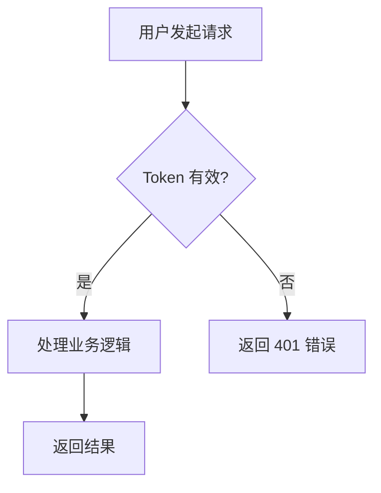
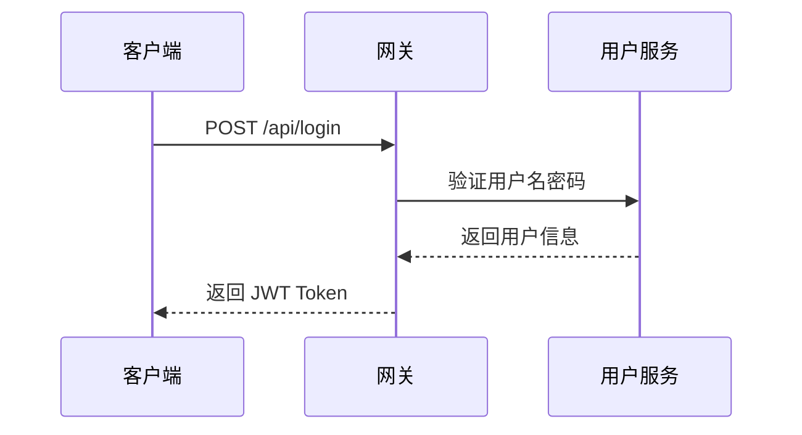

# 文档写作规范指南

> 版本：v1.0  
> 更新日期：2026-04-22

---

## 一、核心写作原则

### 原则 1：以读者为中心，不是以作者为中心

写文档时，脑子里要有一个具体的读者：

- 他是初学者还是有经验的开发者？
- 他现在在做什么任务？
- 他最可能在哪里卡住？

**反例（作者视角）：**
> 本系统采用了先进的多租户架构，基于我们团队深入研究的设计模式实现了...

**正例（读者视角）：**
> 系统支持多租户隔离。每个租户的数据完全独立，互不可见。你只需在请求头传入 `X-Tenant-ID` 即可切换租户上下文。

---

### 原则 2：结论前置，细节在后

开发者没时间看完全文再判断这是不是他要的答案。

**结构模式：**
```
1. 这段文档讲什么（1句话）
2. 关键结论 / 最重要的信息
3. 详细说明
4. 示例
5. 注意事项 / 边界条件
```

---

### 原则 3：Show, don't tell

能用代码说明的，不要只用文字描述。

**反例：**
> 调用该方法时需要传入用户 ID 和权限类型参数，方法会根据参数进行权限校验并返回结果。

**正例：**
> 调用权限校验接口：
> ```java
> boolean hasPermission = permissionService.check(userId, "agent:create");
> if (!hasPermission) {
>     throw new UnauthorizedException("没有创建智能体的权限");
> }
> ```

---

### 原则 4：每个文档只做一件事

一篇文档 = 一个目的。不要在同一篇文档里既教概念又做参考手册。

| 文档类型 | 正确做法 | 错误做法 |
|---------|---------|---------|
| 教程 | 带读者完成一个具体的任务 | 顺带解释所有相关概念 |
| API 参考 | 列出所有参数和返回值 | 讲解如何集成、为什么这样设计 |
| 概念说明 | 解释"是什么"和"为什么" | 给出操作步骤 |
| 操作指南 | 告诉读者怎么完成任务 | 解释背后原理 |

---

## 二、语言风格

### 2.1 人称与语态

| 规范 | 示例 |
|------|------|
| ✅ 使用第二人称"你" | "你需要先安装 Java 17" |
| ✅ 使用主动语态 | "调用此接口返回用户列表" |
| ✅ 使用现在时 | "系统检查权限并返回结果" |
| ❌ 避免被动语态 | ~~"用户 ID 需要被传入"~~ |
| ❌ 避免"我们" | ~~"我们建议你..."~~ → "建议你..." |
| ❌ 避免模糊词 | ~~"可能"、"大概"、"一般情况下"~~ |

### 2.2 专业术语

- 第一次出现时给出说明：`JWT（JSON Web Token，一种无状态认证令牌）`
- 全文保持术语一致：不要一会儿叫"接口"，一会儿叫"API"，一会儿叫"端点"
- 中英文混排时，英文两侧加空格：`使用 Spring Boot 框架`

### 2.3 禁止使用的表达

| 禁止 | 替代 |
|------|------|
| 显而易见 | 直接说明 |
| 很简单 | 直接给步骤 |
| 只需要... | 直接描述操作 |
| 众所周知 | 直接陈述事实 |
| 不言而喻 | 直接解释 |
| 等等... | 列举完整，或明确说"更多见[链接]" |

---

## 三、Markdown 格式规范

### 3.1 标题层级

```markdown
# H1 — 只在文档顶部使用一次，文档标题
## H2 — 主要章节
### H3 — 小节
#### H4 — 仅在必要时使用，避免嵌套过深
```

**规则：**
- 标题下方必须有至少一段说明文字，不能标题紧接标题
- 标题用名词或动词短语，不用问句
- 标题不加标点符号

### 3.2 代码块

**必须指定语言标识符：**

````markdown
```java
// Java 代码
```

```bash
# Shell 命令
```

```json
// JSON 数据
```

```yaml
# YAML 配置
```

```sql
-- SQL 语句
```
````

**代码注释规范：**
```java
// 这是解释性注释 —— 说明"为什么"，不说"是什么"

// ✅ 好注释：校验失败时抛出业务异常，而非返回 null（避免调用方漏判）
if (!valid) throw new BusinessException("参数格式错误");

// ❌ 坏注释：如果不合法则抛出异常
if (!valid) throw new BusinessException("参数格式错误");
```

### 3.3 表格

每个表格必须有表头，列数不超过 6 列，超过时拆分。

```markdown
| 字段名 | 类型 | 必选 | 默认值 | 说明 |
|--------|------|------|--------|------|
| userId | String | 是 | — | 用户唯一标识 |
| pageSize | Integer | 否 | 20 | 每页数量，最大 100 |
```

### 3.4 提示框（Callout）

使用引用块 + emoji 前缀标识提示类型：

```markdown
> 💡 **提示**：这是一个有用的建议。

> ⚠️ **注意**：这里容易出错，请仔细阅读。

> 🚨 **警告**：这个操作不可逆，执行前请确认。

> 📌 **前提条件**：执行此步骤前，需要先完成 [步骤 1](#步骤1)。
```

### 3.5 列表使用

- 无序列表：适合并列项、特性列举
- 有序列表：适合步骤、流程（顺序重要时）
- 列表项超过 7 条时，考虑是否能分组或改用表格

---

## 四、图表规范

### 4.1 何时使用图表

| 场景 | 推荐图表类型 |
|------|------------|
| 展示系统架构 | 架构图（矩形 + 连线） |
| 展示业务流程 | 流程图（Mermaid flowchart） |
| 展示状态变化 | 状态图（Mermaid stateDiagram） |
| 展示数据关系 | ER 图（Mermaid erDiagram） |
| 展示时序交互 | 时序图（Mermaid sequenceDiagram） |

### 4.2 Mermaid 图表示例

**流程图：**
````markdown

````

**时序图：**
````markdown

````

### 4.3 截图规范

- 分辨率：1x 截图，宽度建议 800px 以上
- 格式：PNG（界面截图）或 SVG（图表）
- 文件名：`功能-操作-序号.png`，例如 `agent-create-step1.png`
- 存放路径：`docs/assets/images/`
- 必须加 alt 文本：``

---

## 五、文档检查清单

发布文档前，逐项确认：

### 内容
- [ ] 文档目的明确（教程/操作指南/参考/概念，择一）
- [ ] 有明确的目标受众
- [ ] 前提条件列在最开头
- [ ] 结论或关键信息前置
- [ ] 所有代码示例在干净环境中运行通过
- [ ] 代码示例有预期输出

### 格式
- [ ] 标题层级正确，不超过 H4
- [ ] 代码块指定了语言
- [ ] 表格有表头，格式对齐
- [ ] 链接均有效（本地链接和外部链接）
- [ ] 图片有 alt 文本

### 语言
- [ ] 全程使用第二人称"你"
- [ ] 使用主动语态
- [ ] 无模糊词汇（可能、大概、一般）
- [ ] 专业术语首次出现有解释
- [ ] 中英文混排时英文两侧有空格

---

## 六、写作效率技巧

### 先写骨架，再填肉

1. 先用标题把文档结构定好
2. 在每个标题下写一句话说明这部分讲什么
3. 确认结构合理后，再逐段写内容

### 边用边写

如果你在写一个功能的文档，先自己操作一遍，截图、记录每个步骤。**不要凭记忆写文档**。

### 好的开头很重要

文档的第一段决定读者是否继续读下去。好的开头应该：
- 告诉读者这篇文档能帮他解决什么问题
- 给出阅读时间估计
- 列出前提条件

**模板：**
```
本指南介绍如何[做某事]。完成后，你将[得到什么结果]。

预计阅读时间：约 X 分钟。

**前提条件：**
- 已完成 [XXX 配置](link)
- 了解 [基础知识]
```
