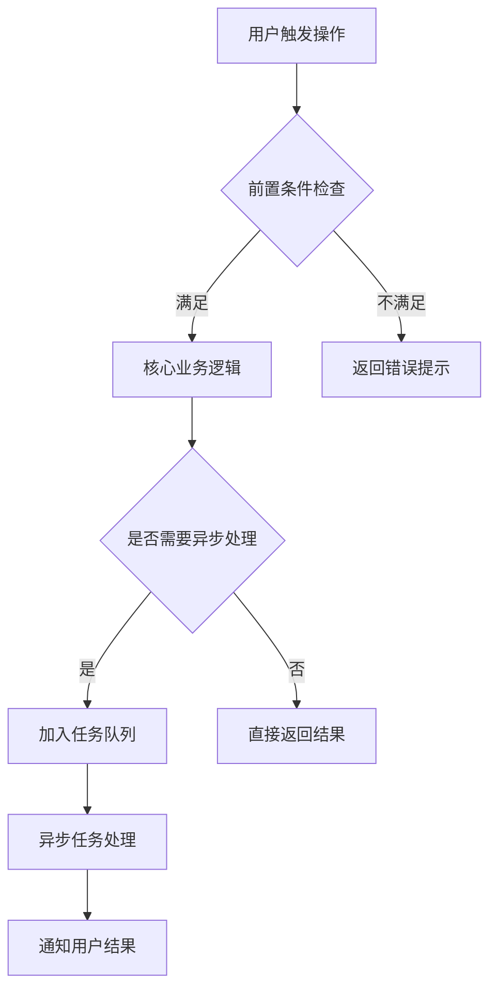

# [功能模块名称] 功能设计文档

> **文档类型**：功能模块文档  
> **版本**：v1.0  
> **创建日期**：YYYY-MM-DD  
> **最后更新**：YYYY-MM-DD  
> **负责人**：@姓名  
> **状态**：🟢 开发中 / 🔵 已上线 / 🟡 待评审 / ⚫ 已废弃

---

## 一、功能概述

<!-- 用 2-3 句话说清楚：这个功能是什么、解决什么问题、谁在用 -->

**功能描述**：[一句话描述这个功能]

**背景与动机**：[为什么需要这个功能？之前的痛点是什么？]

**目标用户**：[谁会使用这个功能？他们的核心诉求是什么？]

---

## 二、功能范围

### 2.1 包含在内（In Scope）

- [功能点 1]
- [功能点 2]
- [功能点 3]

### 2.2 不包含（Out of Scope）

<!-- 明确说明哪些相关功能本期不做，避免误解 -->

- [本期不做的事 1] ← [原因，或者哪期做]
- [本期不做的事 2]

---

## 三、业务流程

### 3.1 主流程



### 3.2 异常流程

| 异常场景 | 触发条件 | 处理方式 |
|---------|---------|---------|
| [场景 1] | [什么情况下发生] | [如何处理，给用户什么提示] |
| [场景 2] | [什么情况下发生] | [如何处理] |

---

## 四、数据模型

### 4.1 核心实体

```java
/**
 * [实体名称]
 * [一句话说明这个实体是什么]
 */
public class XxxEntity {
    
    /** 唯一标识 */
    private Long id;
    
    /** [字段说明] */
    private String name;
    
    /** 状态：0-禁用 1-启用 */
    private Integer status;
    
    /** 租户 ID（多租户隔离） */
    private Long tenantId;
    
    /** 创建时间 */
    private LocalDateTime createTime;
    
    /** 更新时间 */
    private LocalDateTime updateTime;
}
```

### 4.2 数据库表设计

```sql
CREATE TABLE `xxx_table` (
  `id`          BIGINT      NOT NULL AUTO_INCREMENT COMMENT '主键',
  `name`        VARCHAR(100) NOT NULL               COMMENT '名称',
  `status`      TINYINT     NOT NULL DEFAULT 1      COMMENT '状态：0-禁用 1-启用',
  `tenant_id`   BIGINT      NOT NULL                COMMENT '租户ID',
  `create_time` DATETIME    NOT NULL DEFAULT CURRENT_TIMESTAMP COMMENT '创建时间',
  `update_time` DATETIME    NOT NULL DEFAULT CURRENT_TIMESTAMP ON UPDATE CURRENT_TIMESTAMP COMMENT '更新时间',
  `deleted`     TINYINT     NOT NULL DEFAULT 0      COMMENT '逻辑删除：0-未删除 1-已删除',
  PRIMARY KEY (`id`),
  KEY `idx_tenant_id` (`tenant_id`),
  KEY `idx_status` (`status`)
) ENGINE=InnoDB DEFAULT CHARSET=utf8mb4 COMMENT='[表说明]';
```

---

## 五、接口设计

### 5.1 对外 REST API

> 详细接口文档见：[API 参考文档](../api/xxx.md)

| 方法 | 路径 | 说明 |
|------|------|------|
| POST | `/api/v1/xxx` | 创建 |
| GET | `/api/v1/xxx` | 列表查询 |
| GET | `/api/v1/xxx/:id` | 详情查询 |
| PUT | `/api/v1/xxx/:id` | 更新 |
| DELETE | `/api/v1/xxx/:id` | 删除 |

### 5.2 内部服务接口

<!-- 如果有跨服务调用，描述服务间接口 -->

```java
public interface XxxService {
    
    /**
     * 创建 XXX
     * @param request 创建请求体
     * @return 创建结果，包含生成的 ID
     * @throws BusinessException 名称重复时抛出
     */
    XxxVO create(XxxCreateRequest request);
    
    /**
     * 分页查询 XXX 列表
     * @param query 查询条件
     * @return 分页结果
     */
    Page<XxxVO> list(XxxQueryRequest query);
}
```

---

## 六、权限设计

| 操作 | 所需权限标识 | 说明 |
|------|------------|------|
| 创建 | `xxx:create` | 普通用户即可 |
| 查询列表 | `xxx:list` | 只能看自己租户下的数据 |
| 查询详情 | `xxx:detail` | 只能看有权限的记录 |
| 更新 | `xxx:update` | 只能更新自己创建的 |
| 删除 | `xxx:delete` | 需要管理员权限 |

---

## 七、非功能性需求

### 7.1 性能要求

| 指标 | 目标值 | 说明 |
|------|--------|------|
| 接口响应时间（P99） | < 500ms | 查询接口 |
| 接口响应时间（P99） | < 1000ms | 写入接口 |
| 并发支持 | 100 QPS | 单服务实例 |

### 7.2 缓存策略

<!-- 哪些数据需要缓存？缓存策略是什么？ -->

| 缓存对象 | Key 格式 | 过期时间 | 失效策略 |
|---------|---------|---------|---------|
| XXX 详情 | `xxx:detail:{id}` | 10 分钟 | 更新/删除时主动失效 |
| XXX 列表 | — | — | 不缓存，实时查询 |

### 7.3 限流策略

- 创建接口：单用户 10 次/分钟
- 查询接口：单用户 200 次/分钟

---

## 八、测试要点

### 8.1 功能测试场景

| 场景 | 输入 | 预期结果 |
|------|------|---------|
| 正常创建 | 合法的请求参数 | 返回 200，data 包含生成 ID |
| 名称为空 | name = "" | 返回 400，msg 说明 name 必填 |
| 名称重复 | 已存在的 name | 返回 400，msg 说明名称已存在 |
| 无权限访问 | 未携带 Token | 返回 401 |
| 跨租户访问 | 访问其他租户数据 | 返回 404（不泄露存在性） |

### 8.2 边界条件

- [ ] 名称最大长度（50 字符）
- [ ] 分页 pageSize = 100（最大值）
- [ ] 并发创建同名记录（幂等性）
- [ ] 删除后再查询（确认返回 404）

---

## 九、上线 Checklist

- [ ] 代码 Review 通过
- [ ] 单元测试覆盖率 ≥ 60%
- [ ] 接口测试通过
- [ ] 文档更新完成
- [ ] 数据库迁移脚本准备
- [ ] 灰度发布方案确认
- [ ] 回滚方案确认
- [ ] 监控告警配置完成

---

## 十、变更记录

| 版本 | 日期 | 修改内容 | 修改人 |
|------|------|---------|--------|
| v1.0 | YYYY-MM-DD | 初始版本 | @XXX |
